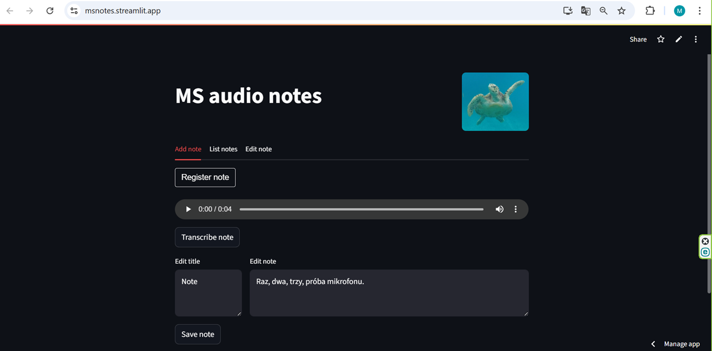

# Aplikacja do notatek z zapisów mowy

Przy pomocy tej aplikacji można tworzyć notatki tekstowe na podstawie wypowiedzi zarejestrowanych przez mikrofon. Aplikacja działa w wielu językach

<a href="https://msnotes.streamlit.app/" class="md-button md-button--primary">Uruchom aplikację</a>
<a href="app.py" class="md-button md-button--primary">Pobierz Notebook</a>

</script>