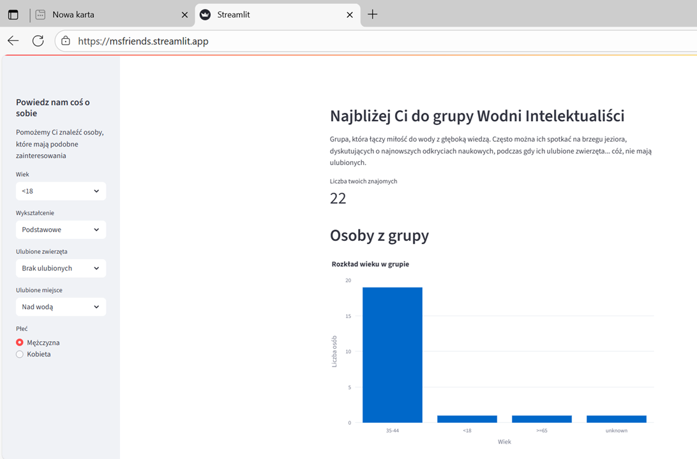

# Aplikacja do wyszukiwania znajomych

Jednym z ćwiczeń w czasie kursu było stworzenie aplikacji do znajdowania osób o podobnych zainteresowaniach. Aplikacja wykorzystuje wyniki wielowątkowej ankiety w celu określenia do jakiego klastra należy osoba, która z niej korzysta. Można przy jej pomocy zorientować się jak wiele osób o podobnych zainteresowaniach i cechach znajduje się w analizowanej społeczności.

<a href="https://msfriends.streamlit.app/" target="_blank" class="md-button md-button--primary">Uruchom aplikację</a>
<a href="app.py" class="md-button md-button--primary">Pobierz Notebook</a>

</script>